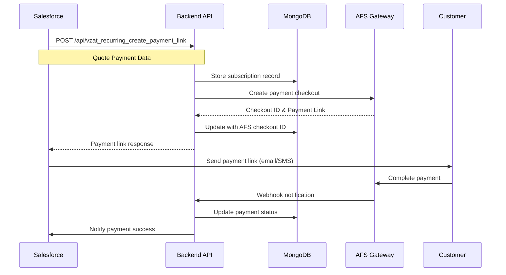

# VZAT Payment & Subscription System Documentation

## 📋 Table of Contents
1. [System Overview](#system-overview)
2. [Architecture](#architecture)
3. [Payment Flow](#payment-flow)
4. [Database Schema](#database-schema)
5. [API Endpoints](#api-endpoints)
6. [Webhook Integration](#webhook-integration)
7. [Frontend Components](#frontend-components)
8. [Testing](#testing)
9. [Configuration](#configuration)
10. [Troubleshooting](#troubleshooting)

---

## 🎯 System Overview

The VZAT Payment & Subscription System is a comprehensive solution for managing recurring payments and subscriptions. It integrates with AFS payment gateway and Salesforce CRM to provide a complete payment processing ecosystem.

### Key Features
- ✅ **Subscription Management**: Create and manage recurring payment schedules
- ✅ **Payment Processing**: Integrated with AFS payment gateway
- ✅ **Webhook Automation**: Automatic payment status updates
- ✅ **Customer Portal**: View payment schedules and manage saved cards
- ✅ **Admin Dashboard**: Monitor subscriptions and payments
- ✅ **Salesforce Integration**: Sync payment data with CRM

---

## 🏗️ Architecture

```
┌─────────────────┐    ┌─────────────────┐    ┌─────────────────┐
│   Frontend      │    │    Backend      │    │   External      │
│   (Angular)     │    │   (Node.js)     │    │   Services      │
├─────────────────┤    ├─────────────────┤    ├─────────────────┤
│ • Customer      │◄──►│ • Payment API   │◄──►│ • AFS Gateway   │
│   Portal        │    │ • Webhook       │    │ • Salesforce    │
│ • Admin         │    │   Handler       │    │ • MongoDB       │
│   Dashboard     │    │ • Subscription  │    │ • Email Service │
│ • Payment       │    │   Controller    │    │                 │
│   Widget        │    │                 │    │                 │
└─────────────────┘    └─────────────────┘    └─────────────────┘
```

### Technology Stack
- **Frontend**: Angular 18, TypeScript, SCSS
- **Backend**: Node.js, Express.js, JavaScript (ES6+)
- **Database**: MongoDB with Mongoose ODM
- **Payment Gateway**: AFS (Arab Financial Services)
- **CRM Integration**: Salesforce REST API
- **Email Service**: Nodemailer with SMTP

---

## 💳 Payment Flow

### 1. Subscription Creation Flow



### 2. First Payment Processing

When a customer makes their first payment:

1. **Payment Creation**:
   - Subscription status: `pending`
   - Payment schedule created with all installments
   - First payment status: `pending`
   - AFS payment type: `DB` (Direct Debit - immediate charge)

2. **Payment Completion**:
   - AFS processes payment and sends webhook
   - Webhook handler detects first payment (subscription status = `pending`)
   - Updates subscription status: `pending` → `active`
   - Updates payment #1 status: `pending` → `completed`
   - Updates payment #2 status: `pending` → `due`
   - Creates customer account
   - Saves card details for future payments
   - Notifies Salesforce

### 3. Recurring Payment Processing

For subsequent payments:

1. **Automatic Processing**:
   - AFS charges saved card on due date
   - Sends webhook with `paymentType: 'DB'`
   - System detects recurring payment (subscription status = `active`)

2. **Database Updates**:
   - Increment `payments_completed` counter
   - Mark current payment as `completed`
   - Mark next payment as `due`
   - Update `last_payment_date`

3. **Completion Check**:
   - If all payments completed: status → `completed`
   - Send completion email to business team

---

## 🗄️ Database Schema

### Vzat_Recurring_Data Collection

```javascript
{
  _id: ObjectId,
  quotepaymentId: String,              // Unique identifier from Salesforce
  OpportunityId: String,               // Salesforce Opportunity ID
  QuoteId: String,                     // Salesforce Quote ID
  CreatedDate: String,                 // Creation date (YYYY-MM-DD)
  Status: String,                      // Initial status from Salesforce
  TotalPrice: Number,                  // Total amount before VAT
  Total_After_VAT_Currency: Number,    // Total amount including VAT
  InstallmentType: String,             // "One_Time" or "Installments"
  InstallmentLeft: Number,             // Total number of installments
  
  // Customer Information
  Customer_name: String,
  opp_owner: String,
  opp_email: String,
  opp_number: String,
  opp_title: String,
  opp_phone: String,
  opp_mobile: String,
  
  // Product Details
  Product_details: [{
    product_name: String,
    product_price: Number,
    product_description: String
  }],
  
  // Payment Information
  subscription_status: String,         // "pending", "active", "completed", "cancelled"
  payments_completed: Number,          // Number of payments completed
  last_payment_date: Date,            // Last successful payment date
  
  // AFS Integration
  afs_checkout_id: String,            // AFS checkout session ID
  afs_registration_id: String,        // AFS card registration ID
  is_subscription: Boolean,           // True for recurring payments
  next_charge_date: Date,             // Next scheduled payment date
  
  // Payment Schedule
  payment_schedule: [{
    installment_number: Number,       // Payment sequence (1, 2, 3...)
    amount: Number,                   // Payment amount
    due_date: String,                 // Due date (YYYY-MM-DD)
    status: String,                   // "pending", "due", "completed", "overdue", "cancelled"
    transaction_id: String,           // AFS transaction ID (when paid)
    payment_date: Date                // Actual payment date (when paid)
  }],
  
  // Timestamps
  createdAt: Date,
  updatedAt: Date
}
```

### Payment Schedule Status Definitions

| Status | Description | When Set |
|--------|-------------|----------|
| `pending` | Payment not yet due | Initial creation |
| `due` | Payment is due for processing | When previous payment completed |
| `completed` | Payment successfully processed | After successful payment |
| `overdue` | Payment past due date | System scheduled job |
| `cancelled` | Payment cancelled | Manual cancellation |

---

## 🔌 API Endpoints

### Payment Creation
```http
POST /api/vzat_recurring_create_payment_link
Content-Type: application/json

{
  "OpportunityId": "string",
  "quotepaymentId": "string",
  "QuoteId": "string",
  "CreatedDate": "YYYY-MM-DD",
  "Status": "string",
  "TotalPrice": number,
  "Total_After_VAT_Currency": number,
  "InstallmentType": "One_Time|Installments",
  "Product_details": [
    {
      "product_name": "string",
      "product_price": number,
      "product_description": "string"
    }
  ],
  "quote_payment_number": "string",
  "Customer_name": "string",
  "opp_owner": "string",
  "opp_email": "string",
  "opp_number": "string",
  "opp_title": "string",
  "opp_phone": "string",
  "opp_mobile": "string"
}
```

**Response:**
```json
{
  "status": true,
  "message": "Payment link created successfully",
  "quotepaymentId": "string",
  "payment_type": "subscription|one-time",
  "payment_link": "string",
  "payment_page_url": "string",
  "afs_checkout_id": "string",
  "payment_schedule": [...],
  "subscription_info": {...}
}
```

### Active Services (Customer Portal)
```http
GET /api/active-services
Authorization: Bearer <token>
```

**Response:**
```json
{
  "status": "success",
  "data": [
    {
      "quotepaymentId": "string",
      "Customer_name": "string",
      "opp_email": "string",
      "subscription_status": "string",
      "payments_completed": number,
      "InstallmentLeft": number,
      "Total_After_VAT_Currency": number,
      "payment_schedule": [...],
      "Product_details": [...]
    }
  ]
}
```

### Webhook Endpoint
```http
POST /api/subscription/webhook/afs
Content-Type: application/json

{
  "id": "string",
  "paymentType": "DB",
  "result": {
    "code": "string",
    "description": "string"
  },
  "amount": number,
  "currency": "AED",
  "merchantTransactionId": "string",
  "registrationId": "string",
  "timestamp": "ISO-8601"
}
```

---

## 🔔 Webhook Integration

### AFS Webhook Configuration

The system automatically configures webhooks when creating payments:

```javascript
// In PostVzatRecurringData.js
const notificationUrl = `${backendUrl}/api/subscription/webhook/afs`;
afsData.append('notificationUrl', notificationUrl);
```

### Webhook Handler Logic

```javascript
// In SubscriptionController.js
export const handleAFSWebhook = async (req, res) => {
  const { paymentType, result, merchantTransactionId } = req.body;
  
  if (paymentType === 'DB' && result.code.startsWith('000.')) {
    const subscription = await findSubscription(merchantTransactionId);
    
    // Determine if first payment or recurring
    const isFirstPayment = subscription.subscription_status === 'pending' && 
                          (subscription.payments_completed || 0) === 0;
    
    if (isFirstPayment) {
      // Activate subscription and mark first payment complete
      await activateSubscription(subscription, transactionId);
    } else {
      // Process recurring payment
      await processRecurringPayment(subscription, transactionId);
    }
  }
};
```

### Webhook Event Types

| Event | Trigger | Action |
|-------|---------|--------|
| First Payment Success | `paymentType: 'DB'`, `subscription_status: 'pending'` | Activate subscription |
| Recurring Payment Success | `paymentType: 'DB'`, `subscription_status: 'active'` | Update payment schedule |
| Payment Failure | `result.code` not starting with '000' | Log failure, send alerts |

---

## 🖥️ Frontend Components

### Active Services Component

**Location**: `frontend/src/app/customer/active-services/`

**Key Features**:
- Display subscription list with payment schedules
- Show individual payment statuses with color-coded badges
- Modal popup with detailed payment information
- Real-time status updates

**Component Structure**:
```typescript
export class ActiveServicesComponent {
  subscriptions: any[] = [];
  
  ngOnInit() {
    this.loadActiveServices();
  }
  
  loadActiveServices() {
    this.activeServicesService.getActiveServices().subscribe(data => {
      this.subscriptions = data;
    });
  }
  
  getStatusBadgeClass(status: string): string {
    const statusMap = {
      'completed': 'badge-success',
      'due': 'badge-warning',
      'pending': 'badge-secondary',
      'overdue': 'badge-danger',
      'cancelled': 'badge-dark'
    };
    return statusMap[status] || 'badge-secondary';
  }
}
```

### Payment Schedule Display

```html
<div class="payment-schedule">
  <div *ngFor="let payment of subscription.payment_schedule" 
       class="payment-item">
    <span class="payment-number">Payment {{payment.installment_number}}</span>
    <span [class]="getStatusBadgeClass(payment.status)">
      {{payment.status | titlecase}}
    </span>
    <span class="payment-amount">{{payment.amount}} AED</span>
    <span class="due-date">Due: {{payment.due_date}}</span>
  </div>
</div>
```

---

## 🧪 Testing

### Test Scripts

The system includes comprehensive test scripts for development and debugging:

#### 1. Simple Subscription Tester
```bash
# List all subscriptions
node test-subscription-simple.js list

# Check specific subscription
node test-subscription-simple.js check <quotepaymentId>

# Simulate successful payment
node test-subscription-simple.js pay <quotepaymentId> [amount]

# Simulate failed payment
node test-subscription-simple.js fail <quotepaymentId>
```

#### 2. Advanced Webhook Tester
```bash
# Test webhook with specific parameters
node test-subscription-webhook.js <quotepaymentId> <paymentNumber> [success|failed] [amount]
```

### Test Scenarios

1. **First Payment Flow**:
   ```bash
   # Check pending subscription
   node test-subscription-simple.js check aAWdu0000005XeTGAU
   
   # Simulate first payment
   node test-subscription-simple.js pay aAWdu0000005XeTGAU 525
   
   # Verify subscription activated
   node test-subscription-simple.js check aAWdu0000005XeTGAU
   ```

2. **Recurring Payment Flow**:
   ```bash
   # Simulate second payment
   node test-subscription-simple.js pay aAWdu0000005XhhGAE 210
   
   # Verify payment progression
   node test-subscription-simple.js check aAWdu0000005XhhGAE
   ```

3. **Failure Scenarios**:
   ```bash
   # Test payment failure
   node test-subscription-simple.js fail aAWdu0000005XhhGAE
   ```

### Manual Database Updates

For fixing existing data issues:

```bash
# Run manual payment update script
node manual-payment-update.js
```

---

## ⚙️ Configuration

### Environment Variables

Create `.env` file in backend directory:

```env
# Database
MONGODB_URI=mongodb://localhost:27017/vzat_sandbox

# AFS Payment Gateway
AFS_DOMAIN=https://test.oppwa.com
AFS_ENTITY_ID=your_entity_id
AFS_ACCESS_TOKEN=your_access_token

# Application URLs
BACKEND_URL=http://localhost:3000
FRONTEND_URL=http://localhost:4200

# Salesforce Integration
SF_LOGIN_URL=https://test.salesforce.com
SF_USERNAME=your_username
SF_PASSWORD=your_password
SF_SECURITY_TOKEN=your_token
SF_CLIENT_ID=your_client_id
SF_CLIENT_SECRET=your_client_secret

# Email Configuration
SMTP_HOST=your_smtp_host
SMTP_PORT=587
SMTP_USER=your_email
SMTP_PASS=your_password
```

### AFS Configuration

The system uses the following AFS settings:

- **Payment Type**: `DB` (Direct Debit) for immediate charging
- **Currency**: `AED` (UAE Dirham)
- **Webhook URL**: Automatically configured during payment creation
- **Recurring Type**: `INITIAL` for subscription setup

### Database Indexes

Recommended MongoDB indexes for optimal performance:

```javascript
// Create indexes for faster queries
db.vzat_recurring_datas.createIndex({ "quotepaymentId": 1 }, { unique: true });
db.vzat_recurring_datas.createIndex({ "opp_email": 1 });
db.vzat_recurring_datas.createIndex({ "subscription_status": 1 });
db.vzat_recurring_datas.createIndex({ "CreatedDate": -1 });
db.vzat_recurring_datas.createIndex({ "payment_schedule.due_date": 1 });
```

---

## 🔧 Troubleshooting

### Common Issues

#### 1. Payment Not Updating After Success

**Symptoms**: Payment completed on AFS but database not updated

**Causes**:
- Missing webhook URL in payment creation
- Webhook endpoint not accessible
- Database connection issues

**Solutions**:
```bash
# Check webhook URL is set
grep -n "notificationUrl" Controllers/PostVzatRecurringData.js

# Test webhook endpoint
curl -X POST http://localhost:3000/api/subscription/webhook/afs \
  -H "Content-Type: application/json" \
  -d '{"test": "webhook"}'

# Manual payment update
node manual-payment-update.js
```

#### 2. Subscription Status Not Changing

**Symptoms**: First payment completed but subscription status still `pending`

**Debugging**:
```bash
# Check subscription details
node test-subscription-simple.js check <quotepaymentId>

# Simulate first payment
node test-subscription-simple.js pay <quotepaymentId>
```

#### 3. Payment Schedule Not Updating

**Symptoms**: Payment marked as completed but next payment not marked as due

**Check**:
```javascript
// Verify payment schedule update logic
const subscription = await Vzat_Recurring_Data.findById(subscriptionId);
console.log('Payment Schedule:', subscription.payment_schedule);
```

#### 4. Frontend Not Showing Updates

**Solutions**:
```bash
# Rebuild frontend
cd frontend && npm run build

# Check API connection
curl http://localhost:3000/api/active-services

# Check browser console for errors
```

### Logging and Monitoring

#### Backend Logging
The system includes comprehensive logging:

```javascript
// Example log output
🔔 =================== AFS WEBHOOK RECEIVED ===================
📅 Timestamp: 2025-08-14T07:51:52.780Z
🔍 Extracted webhook data:
  - Transaction ID: sim_1755157912778_v2b6qv68h
  - Payment Type: DB
  - Result Code: 000.100.110
✅ Subscription updated successfully
```

#### Database Logging
All API calls are logged in `common_db_log_datas` collection:

```javascript
{
  Method_Name: "/api/vzat_recurring_create_payment_link",
  Request: {...},
  Response: {...},
  Date_and_Time: ISODate(...)
}
```

### Performance Monitoring

#### Key Metrics to Monitor
- Payment processing time
- Webhook response time
- Database query performance
- Failed payment rate
- Subscription activation rate

#### Database Queries
```javascript
// Check subscription statistics
db.vzat_recurring_datas.aggregate([
  {
    $group: {
      _id: "$subscription_status",
      count: { $sum: 1 }
    }
  }
]);

// Check payment success rate
db.vzat_recurring_datas.aggregate([
  {
    $unwind: "$payment_schedule"
  },
  {
    $group: {
      _id: "$payment_schedule.status",
      count: { $sum: 1 }
    }
  }
]);
```

---

## 📊 System Flow Diagrams

### Payment Creation Flow
```
Salesforce → Backend API → MongoDB → AFS Gateway → Customer
    ↓           ↓           ↓         ↓           ↓
   Quote    Store Data   Payment   Checkout    Payment
  Payment    Record      Link      Session      Page
```

### Webhook Processing Flow
```
AFS Gateway → Backend Webhook → Database Update → Salesforce Notification
     ↓             ↓               ↓                    ↓
   Payment      Process         Update Status       Update CRM
  Completed     Webhook        & Schedule          Records
```

### Customer Journey
```
1. Receive Payment Link (Email/SMS)
2. Complete Payment on AFS Page
3. Automatic Account Creation
4. Access Customer Portal
5. View Payment Schedule
6. Automatic Recurring Payments
7. Subscription Completion
```

---

## 📝 API Response Examples

### Successful Payment Link Creation
```json
{
  "status": true,
  "message": "Subscription payment link created successfully",
  "quotepaymentId": "aAWdu0000005XhhGAE",
  "payment_type": "subscription",
  "first_payment_due_date": "2025-08-14",
  "next_installment_due_date": "2025-09-10",
  "payment_amount": 210,
  "installments_left": 5,
  "installment_type": "Installments",
  "payment_link": "https://test.oppwa.com/v1/paymentWidgets.js?checkoutId=...",
  "payment_page_url": "http://localhost:4200/payment/7C5B0520B5...",
  "afs_checkout_id": "7C5B0520B5154349AC09655B99A6AF7D.uat01-vm-tx04",
  "payment_schedule": [
    {
      "installment_number": 1,
      "amount": 210,
      "due_date": "2025-08-14",
      "status": "pending"
    },
    {
      "installment_number": 2,
      "amount": 210,
      "due_date": "2025-09-10",
      "status": "pending"
    }
  ],
  "subscription_info": {
    "total_installments": 5,
    "remaining_installments": 4,
    "next_charge_date": "2025-09-10",
    "installment_amount": 210,
    "total_amount": 1050
  }
}
```

### Webhook Success Response
```json
{
  "message": "Webhook processed successfully",
  "subscriptionId": "689d8ba315007ed5de0e83e2"
}
```

---

## 🔐 Security Considerations

### Webhook Security
- Validate webhook source (AFS IP whitelist)
- Verify webhook signature if available
- Use HTTPS for all webhook endpoints
- Implement rate limiting

### Data Protection
- Encrypt sensitive customer data
- Secure database connections
- Implement proper authentication
- Log security events

### Payment Security
- Use PCI-compliant payment processing
- Never store full card details
- Implement secure tokenization
- Monitor for suspicious activities

---

## 📈 Future Enhancements

### Planned Features
1. **Payment Retry Logic**: Automatic retry for failed payments
2. **Dunning Management**: Automated reminders for overdue payments
3. **Subscription Modifications**: Allow plan changes and upgrades
4. **Analytics Dashboard**: Payment and subscription analytics
5. **Multi-Currency Support**: Support for multiple currencies
6. **Mobile App Integration**: Native mobile application
7. **Advanced Reporting**: Comprehensive business reports
8. **Customer Self-Service**: Enhanced customer portal features

### Technical Improvements
1. **Microservices Architecture**: Split into smaller services
2. **Event-Driven Architecture**: Implement event sourcing
3. **Caching Layer**: Redis for improved performance
4. **Load Balancing**: Horizontal scaling capabilities
5. **Container Deployment**: Docker and Kubernetes support
6. **API Rate Limiting**: Implement comprehensive rate limiting
7. **Real-time Notifications**: WebSocket integration
8. **Automated Testing**: Comprehensive test suite

---

## 📞 Support and Maintenance

### Development Team Contacts
- **Backend Development**: Node.js/Express team
- **Frontend Development**: Angular team
- **Database Administration**: MongoDB team
- **DevOps**: Infrastructure team

### Maintenance Schedule
- **Daily**: Monitor payment processing and webhook health
- **Weekly**: Review failed payments and system performance
- **Monthly**: Database optimization and cleanup
- **Quarterly**: Security audit and dependency updates

### Emergency Procedures
1. **Payment Processing Down**: Check AFS gateway status
2. **Database Issues**: Verify MongoDB connection and indexes
3. **Webhook Failures**: Check endpoint accessibility and logs
4. **High Error Rate**: Review application logs and monitor alerts

---

*Documentation Version: 1.0*  
*Last Updated: August 14, 2025*  
*Next Review: September 14, 2025*
